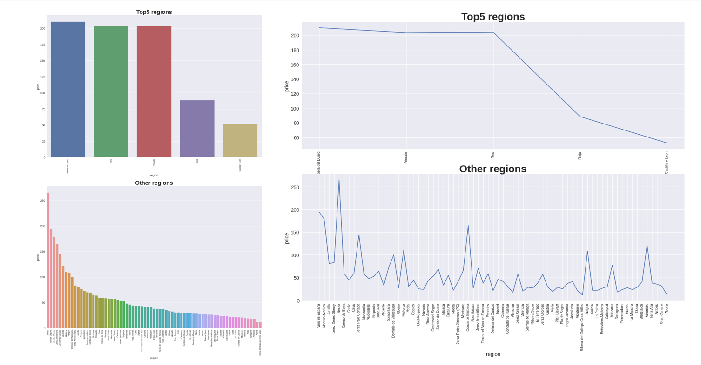

# Wine Price Prediction
## Analyzing Some Main Factors That Make Big Impact on Wine's Price

**Qian Fu**

### Business Problem:

The goal of this project is to help my stakeholders understand how are some factors can impact the wine's price and why my model can do the best work to predict the wine's price based on some metrics.

### Source of data:
•	fedesoriano. (April 2022). Spanish Wine Quality Dataset. Retrieved [Date Retrieved] from https://www.kaggle.com/datasets/fedesoriano/spanish-wine-quality-dataset

## Methods
### To clean the dataset, I have listed these steps:
•	Drop the duplicates and made total rows from 7500 to 2048.

•	There is a of total 650 missing values in three columns. 

o	 I decided to drop two rows. 2 missing values in the Year column. 

o	 To prevent model performance bias, for 106 missing values, I decided to create a new label “Unidentified".  in the Type column. 

o  After checking the statistic information of Body Score and Acidity Score column, I decided to fill the missing values in these two columns with the Mean Value.

•	There is no wrong datatype, no inconsistency in category columns, and no impossible number in numeric columns. 

### To get the data ready for modeling, I have cited the following steps:
•	One hot encodes the Nominal features.

•	Scale the Numeric features.

•	Impute the missing values with Mean Strategy.

## Visualizations:

### Cited below are two Explanatory Data Visualizations to help my stakeholders better understand trends in the data.

#### The bar and line plots both show the wine’s price in top 5 regions and the other 71 regions.

key findings of this Visual: I split the dataset into two sub datasets after I found that 70% of wine collected in this data is from 5 regions out of 76 regions. We can see that there are 3 regions in the top 5 regions where the average wine price is above $200, and only one region where the rest of the 71 regions has the average wine price being above $200. Overall, the wine price in the top 5 regions is much higher than the wine price in the other 71 regions. 

#### These bar charts show the different rating score wine’s price in three levels.

Key findings of this Visual: There is only a moderate and positive correlation between price and rating. The other features all have a very weak correlation with price. We can see that the general trend has the higher rating score and the higher wine price, but the wine with the highest average price is not scored the highest. The wines in the top 5 regions follow the higher score higher price. Overall, we can see that the price gap between each rating score is considered as substantial. An interesting finding is that the 10 most expensive wines are scored at 4.6 and 4.7 instead of the highest score 4.9. 

## Model

The final model I chose is K-Nearest Neighbors model. The problem to be solved in this model is to predict the price of the red wine based on the given features. 
After trying all the models and hyperparameters tested, I can tell that the best final model is the KNN model. It had the highest R2 score which means it explained the highest amount of variance in the data. It also had the lowest RMSE score which means there was, on average, having less error in the predictions with this model.
The hyper tuned KNN model had a leaf_ size of 30, and in the n_neighborhood of 5.

## Recommendations

After exploring the data, I found that some factors play a crucial role with impacting the wine’s price, such as, the region of where the wine is made, the rating score of the wine, and which year the grapes were harvested. The above visuals show the key findings that could cause us to think about the reasons behind, such as, why only a few regions in Spain produce better quality wine? What are the characters of these few regions compared to other regions that produce cheaper wine? My recommendation is to do further research on these factors would make a substantial impact on the wine’s price.

## Limitations & Next Steps

This dataset targets the wine from the same country which is Spain. There are only 10 features that price prediction is based on. The dataset is considered as small. I will collect more data information of other wine regions from the world. Then I can try out more models.

### For further information

For any additional questions, please contact qfu885612@gmail.com. Qian Fu #: 3312763359.
